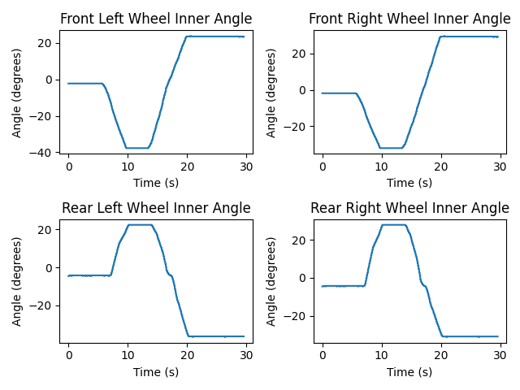

# Trimble-Code-Challenge
This is an implementation of a basic CAN parser for a subset of SPNs within the J1939 electronic steering control PGN (0x00F00B).
It was designed to be general, able to be easily expanded to parse many more PGNs and SPNs.

## Compilation and Running
This program is compiled with CMake and uses Python and matplotlib to plot the output.
```
sudo apt-get update
sudo apt-get install cmake python3 python3-pip
sudo pip install matplotlib
git clone https://github.com/ad3154/Trimble-Code-Challenge.git
cd Trimble-Code-Challenge
cmake .
make
./parser [input file path] [output file path]
```
Example (uses the test CAN log included with this repo):
```
./parser Test1_Test1.asc output.csv
```

## Plotting the Results
```
python3 parseOutput.py [input file path] [output file path]
```
Example:
```
python3 parseOutput.py output.csv plot.png
```

## Test File Results
 

## An Overview of the Challenges
The goal for this challenge was to parse and plot wheel angles from two suspect parameter numbers (SPNs) out of a specific J1939 CAN message and write the wheel angle data to different file. 
This assignment presented some clear challenges:
* Other messages were also present in the log, requiring filtering by PGN.
* Standard 11-bit ID messages were mixed in with the 29-bit extended ID messages, which required some additional rejection, since they do not contain a PGN.
* No address claims or requests for address claim were present in the log. This is not so much a challenge and more of an interesting note. It represents a limitation to the filtering that is possible, as we can only filter on things like address, and PGN rather than ISO11783 NAME fields (like device class, manufacturer number, etc.)

## My Approach
When I think about designing a CAN parser, I think it is safe to say that neither I nor anyone consuming such a parser probably wants me to have to make a different parser for every signal or PGN. As a result, I tried to take a generalized approach including:
* Create a generic set of objects to represent the data items of interest and data required to filter the data
* Create a generic way to set filters based on SPNs
* Use a generic method to scale and offset signals
* Have ways to still access the raw data in signals in case they are needed
* Consider how the parser might be extended in the future, such as loading SPN data from a Vector dbc file, and design it in a way that will make converting to such an approach relatively painless
* Use an output format that was generic, and not tied to any specific data format
 In short, I tried to create a generic set of objects that would easily allow for future extensions and improvements of the parser and tried to use object-oriented programming to make the code as readable and reusable as possible.

## Some Limitations
This parser has some limitations that a full-fledged parser would ideally solve. These limitations are self-imposed for brevity’s sake in this assignment.

* This solution does not contain address or control function ISO NAME filtering. Ideally, any ISOBUS or J1939 CAN parser meant for “production” use would be able to tolerate a device changing its address mid-log, for example. This parser does not, and that works OK for the assignment since no address claims are present in the log provided.
* SPN and PGN filtering values are hard-coded. Ideally this would be dynamic, and perhaps loaded from a file and configurable via command line arguments. My approach is a tradeoff for a faster turnaround time to produce the parser.
* This parser isn’t very embedded friendly, again mostly for development speed’s sake. If something like this was meant for an embedded platform, it would not return concrete classes in functions or use standard template storage classes. A great deal of read-only memory space could be conserved with some additional time.
* The parser is limited to one CAN message per timestamp. This is probably alright given a baud rate of 250K and the timestamp resolution in the test CAN log file but might need a different approach at higher baud rates or lower CAN probe timestamp resolutions.
